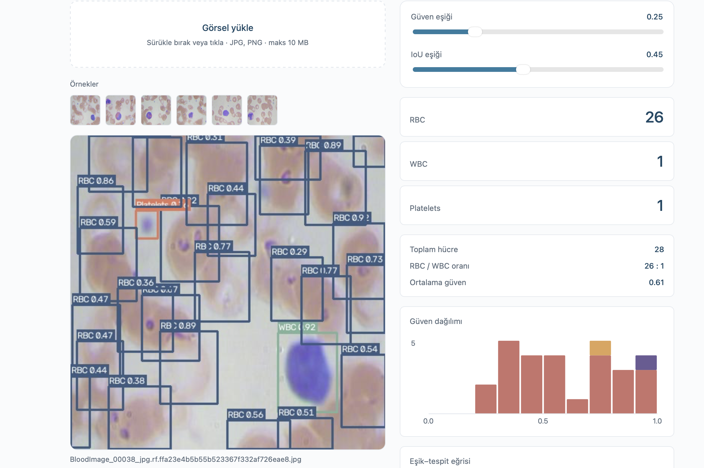
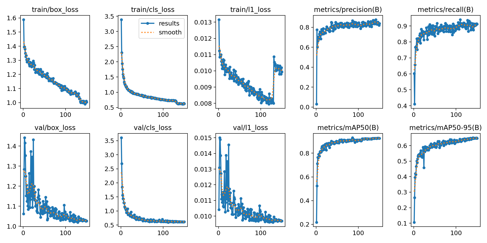
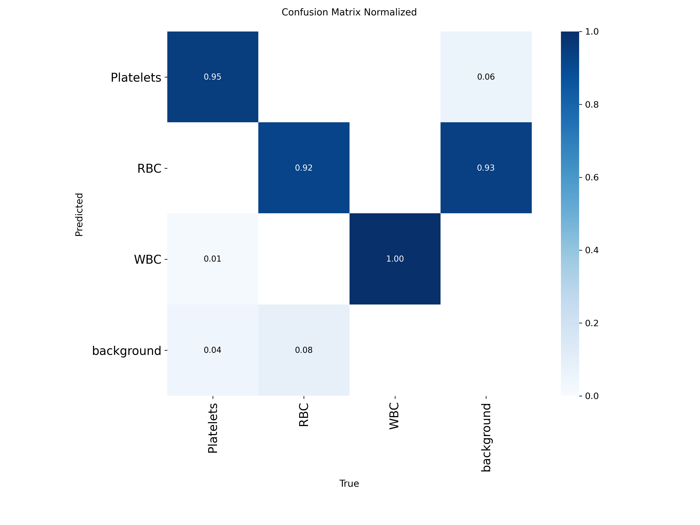
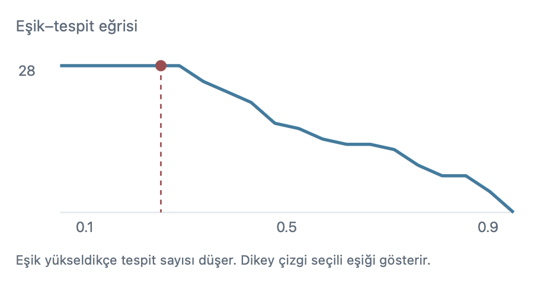
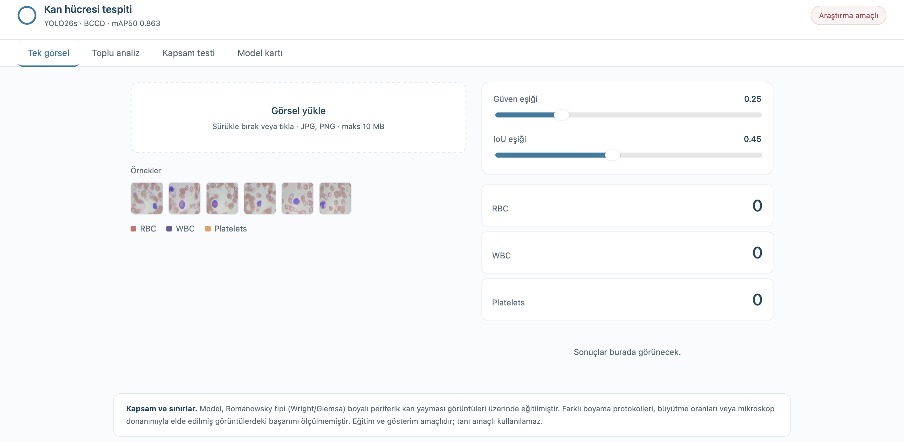

<div align="center">

# Blood Cell Detection with YOLO26

Object detection and automated counting of red blood cells, white blood cells
and platelets in peripheral blood smear images.

[](https://python.org)
[](https://docs.ultralytics.com)
[](https://fastapi.tiangolo.com)
[](LICENSE)

**mAP50 0.863** · **mAP50-95 0.605** · YOLO26s · BCCD

</div>

> **Research and educational use only.** This is not a diagnostic device and
> must not be used for clinical decision-making.



---

## Contents

- [Overview](#overview)
- [Results](#results)
- [Experiments](#experiments)
- [Scope and limitations](#scope-and-limitations)
- [Interface](#interface)
- [Setup](#setup)
- [API reference](#api-reference)
- [Project structure](#project-structure)
- [Dataset](#dataset)
- [References](#references)

---

## Overview

The model detects three cell types in a stained blood smear and reports
per-class counts, the RBC/WBC ratio and confidence statistics. Manual cell
counting is a routine but time-consuming task in haematology laboratories;
this project explores how far a small single-stage detector can go on that
problem, and where it stops being reliable.

| Class | Cell type | Visual signature | Instances |
|---|---|---|---|
| RBC | Erythrocyte | Ring shape with central pallor | 4,155 |
| WBC | Leukocyte | Large, dark purple nucleus | 372 |
| Platelets | Thrombocyte | Small dark specks | 361 |

---

## Results

Final model: **YOLO26s**, 9.5M parameters, 640px input. Trained for 135 epochs
with early stopping at epoch 95, cosine learning rate schedule, mosaic
disabled for the last 20 epochs.

### Test set (36 images, 471 boxes)

| Class | Precision | Recall | mAP50 | mAP50-95 |
|:---|---:|---:|---:|---:|
| Platelets | 0.687 | 0.861 | 0.755 | 0.392 |
| RBC | 0.657 | 0.879 | 0.866 | 0.636 |
| WBC | 0.957 | 0.919 | 0.968 | 0.787 |
| **Overall** | **0.767** | **0.886** | **0.863** | **0.605** |

Validation reaches mAP50 0.928 and mAP50-95 0.650. The test split is small —
36 images and only 36 platelet instances — so per-class test figures carry
noticeable variance.

### Training curves



### Confusion matrix



---

## Experiments

Three hypotheses were tested. Two of them failed, which turned out to be the
more informative outcome.

| Run | Model | imgsz | Augmentation | mAP50 | mAP50-95 |
|:---|:---|---:|:---|---:|---:|
| Baseline | YOLO26n | 640 | default | 0.878 | 0.589 |
| Higher resolution | YOLO26n | 1024 | default | 0.867 | 0.594 |
| **Final** | **YOLO26s** | **640** | **colour + scale + rotation** | **0.863** | **0.605** |

### Resolution did not help small objects

Platelets are the smallest class and localise poorly — mAP50-95 of 0.392
against mAP50 of 0.755 means the model *finds* them but does not fit tight
boxes. On a 20px object a 3px offset costs roughly 25% IoU; on a 200px WBC
the same offset is negligible.

Raising the input resolution from 640 to 1024 was expected to fix this. It did
not: platelet mAP50-95 moved from 0.409 to 0.403, within noise. The source
images are 416×416, so upscaling adds no pixel information that was not
already there. Counter to intuition, the class that *did* benefit was WBC —
the largest one — improving from 0.748 to 0.791.

### Augmentation improved accuracy and robustness together

Aggressive HSV shifts (`hsv_s=0.9`, `hsv_v=0.6`), scale jitter (`scale=0.8`),
rotation (`degrees=20`) and `copy_paste=0.3` raised recall across every class:

| Class | Recall before | Recall after |
|:---|---:|---:|
| Platelets | 0.694 | 0.861 |
| RBC | 0.734 | 0.879 |

Precision fell in exchange. For a counting task this trade is preferable — a
missed cell cannot be recovered by tuning, a false positive can be filtered.
Rotation is physically valid here because blood cells have no canonical
orientation.

### Test-time augmentation is unavailable

YOLO26's NMS-free end-to-end head does not support multi-scale inference;
passing `augment=True` silently falls back to single-scale prediction. This
rules out a technique that typically adds 1–2 points on YOLOv8/v11 — a
concrete consequence of the architecture choice.

### Generalisation

On the baseline run: mAP50 was 0.947 on train, 0.900 on validation, 0.878 on
test. A 0.069 train-to-test gap on a 765-image dataset indicates the model
generalises rather than memorises. Early stopping triggered at epoch 95 of a
planned 150.

### Confidence threshold



| conf | Precision | Recall | mAP50 |
|---:|---:|---:|---:|
| **0.25** | 0.769 | **0.886** | **0.814** |
| 0.35 | 0.775 | 0.876 | 0.802 |
| 0.45 | 0.784 | 0.827 | 0.768 |
| 0.55 | 0.817 | 0.788 | 0.740 |

Raising the threshold buys 0.05 precision at the cost of 0.10 recall. The
default stays at 0.25.

---

## Scope and limitations

**Staining protocol.** Training images are Romanowsky-type (Wright/Giemsa)
stained peripheral smears. Colour is a strong cue for the model, so
Diff-Quik, unstained or phase-contrast preparations fall outside its range.

**Closed-set architecture.** The model recognises exactly three classes and
must assign every detection to one of them — there is no "unknown" output.
Pathological cells, foreign objects and entirely unrelated images all receive
boxes. This is the single most important barrier to clinical use, and it is a
property of the dataset rather than the architecture.

**Label completeness.** BCCD contains unlabelled red blood cells. Some
detections scored as false positives are in fact correct, which depresses the
measured RBC precision of 0.657.

**No external validation.** Performance on images from other laboratories,
microscopes or magnifications has not been quantified, because no labelled
external data was available. Informal checks on outside images produced
plausible counts at mean confidence 0.76, but that is an observation, not a
metric.

The interface surfaces these limits rather than hiding them: a scope tab
demonstrates the closed-set behaviour on arbitrary images, and every result
carries a warning when mean confidence falls below 0.5 or no cells are found.

---

## Interface



Four tabs:

- **Single image** — detection with live confidence and IoU thresholds, class
  counts, confidence histogram and a threshold–detection curve
- **Batch analysis** — up to 30 images, per-image counts with CSV export
- **Scope test** — upload any image and observe the closed-set behaviour
- **Model card** — architecture, dataset provenance, measured metrics, limits

---

## Setup

```bash
git clone https://github.com/Aysenurkislioglu/blood-cell-yolo.git
cd blood-cell-yolo
python3 -m venv .venv && source .venv/bin/activate
pip install -r requirements.txt
```

### Command line

```bash
python -m src.cli data/samples/<image>.jpg -o annotated.jpg
python -m src.cli <image>.jpg --conf 0.4 --iou 0.5
```

### Web interface

```bash
python -m uvicorn app.main:app --port 8000
```

Open `http://localhost:8000`. Interactive API documentation is at `/docs`.

### Docker

```bash
docker build -t blood-cell-yolo .
docker run -p 7860:7860 blood-cell-yolo
```

---

## API reference

| Method | Endpoint | Description |
|:---|:---|:---|
| `POST` | `/predict` | Single image; returns counts, detections, annotated image |
| `POST` | `/predict/batch` | Up to 30 images; per-image rows and aggregate summary |
| `GET` | `/info` | Model card: architecture, dataset, metrics, limitations |
| `GET` | `/health` | Liveness check |

Query parameters `conf` (0.01–0.95) and `iou` (0.1–0.95) are accepted on both
prediction endpoints.

---

## Project structureblood-cell-yolo/

├── app/
│ ├── main.py FastAPI service
│ └── static/ Web interface (HTML, CSS, vanilla JS)
├── src/
│ ├── config.py Paths, class names, default thresholds
│ ├── predict.py Inference wrapper with cached model loading
│ ├── cli.py Command line entry point
│ └── utils/viz.py Box drawing and cell counting
├── models/best.pt Trained weights (19 MB)
├── data/samples/ Example images from the test split
├── reports/
│ ├── results.csv Per-epoch training metrics
│ └── figures/ Curves, confusion matrix, screenshots
├── Dockerfile
└── requirements.txt---

## Dataset

BCCD (Blood Cell Count and Detection), obtained through Roboflow Universe
(`joseph-nelson/bccd`, version 4, YOLO export, 416×416 augmented variant).
874 images split 765 / 73 / 36 across train, validation and test.

Class distribution is heavily imbalanced — 4,155 RBC boxes against 372 WBC
and 361 platelets, roughly 85% to 7.6% to 7.4%. This is why per-class metrics
are reported throughout rather than a single aggregate: a model strong only on
RBC would still post a respectable overall score.

The same data is also available on Kaggle in Supervisely format; the Roboflow
export was chosen to skip the annotation format conversion step.

Licensed under MIT. Originally released by cosmicad and akshaylamba.

---

## References

- Ultralytics YOLO — https://docs.ultralytics.com
- BCCD Dataset — https://public.roboflow.com/object-detection/bccd

---

## License

MIT — see [LICENSE](LICENSE).
